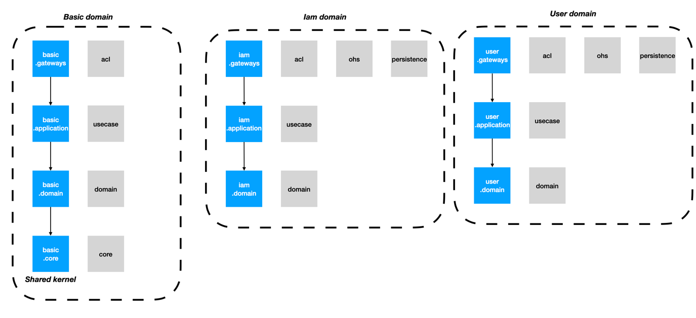
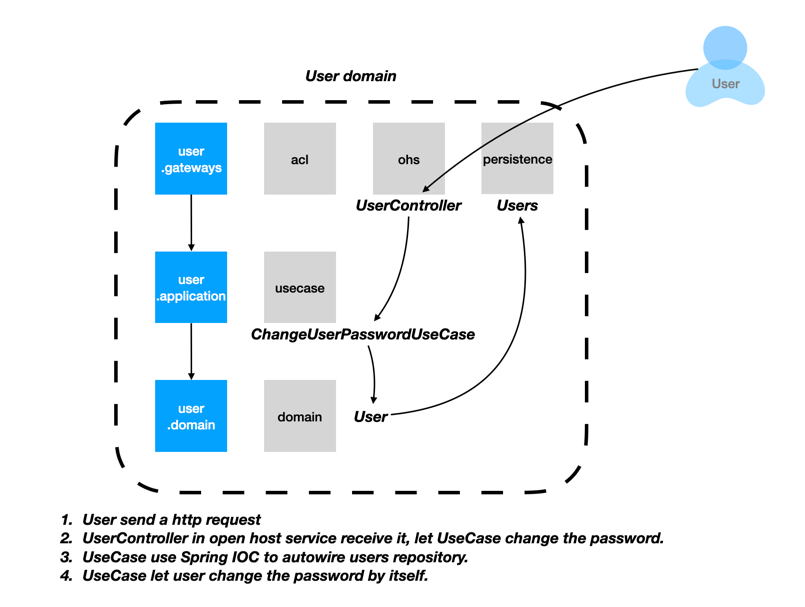

# QOMOLANGMA

## [英文](./README.md) | [中文](./README.zh.md)

本仓库包含开发全部所需材料，使用这些材料即可快速构建一个全新的开发环境。

## 准备环境

### 容器技术

本项目的开发依赖容器技术，需要开发环境有Docker环境。如您尚未配置Docker环境，请先自行配置Docker环境。Mac OS X和Windows请安装Docker Desktop，Linux系统直接安装Docker
CE.以下信息供参考：

- Mac OS X: https://www.docker.com/products/docker-desktop
- Windows: https://www.docker.com/products/docker-desktop
- Ubuntu: https://docs.docker.com/engine/install/ubuntu/
- CentOS: https://docs.docker.com/engine/install/centos/

### 开发平台

这个项目采用了Java和Kotlin的混合开发模式，严重依赖Java生态系统。请先安装OpenJDK
17先安装。

- OpenJDK 17 for Windows:

  https://download.java.net/java/GA/jdk17.0.2/dfd4a8d0985749f896bed50d7138ee7f/8/GPL/openjdk-17.0.2_windows-x64_bin.zip
- OpenJDK 17 for Mac:

  https://download.java.net/java/GA/jdk18/43f95e8614114aeaa8e8a5fcf20a682d/36/GPL/openjdk-18_macos-x64_bin.tar.gz

- OpenJDK 17 for Linux:

  https://download.java.net/java/GA/jdk18/43f95e8614114aeaa8e8a5fcf20a682d/36/GPL/openjdk-18_linux-x64_bin.tar.gz

### 开发工具

为了更好的开发体验以及更高的开发效率，请使用IntelliJ IDEA作为默认开发工具：

- IntelliJ IDEA: https://www.jetbrains.com/idea/

### 脚本

#### 依赖服务

这个项目的所有依赖性服务都可以以自动化的方式建立。你将需要编写你的依赖性
服务部署脚本。要建立一个全新的环境。
在项目根目录下执行以下命令：

```shell
sh ./scripts/setup-local
```

#### 安装前端依赖

```shell script
./gradlew npm_install
```

#### 提交前代码检查

为了守住质量基线，为持续集成提供必要的基础，项目提供了必要的基础设施，质量门禁便是其中之一 。

质量门禁提供了静态代码检查、单元测试、集成测试、测试覆盖率、前端测试等各项质量检查项，
**开发每次推送代码至代码库前务必在本地执行质量门禁检查**，并且在代码被推送至代码仓库后，构建服务器也会触发质量门禁。本地执行质量检测直接执行以下命令：

```shell script
sh ./scripts/check-all
```

#### 运行主项目

```shell script
./gradlew bootRun
```

#### 安装前端依赖

```shell script
./gradlew :qomolangma.webui:yarn_build
```

#### 监听前端测试

```shell script
./gradlew :qomolangma.webui:yarn_test
```

#### 构建docker镜像

```shell script
sh ./scripts/build-all
```

## 技术架构

区别于传统开发框架，我们使用整洁架构作为项目的思想指导框架,进行测试驱动开发(TDD) + 领域驱动设计(DDD)的实践。

[https://medium.com/@matiasvarela/hexagonal-architecture-in-go-cfd4e436faa3](https://medium.com/@matiasvarela/hexagonal-architecture-in-go-cfd4e436faa3)

[https://blog.cleancoder.com/uncle-bob/2012/08/13/the-clean-architecture.html](https://blog.cleancoder.com/uncle-bob/2012/08/13/the-clean-architecture.html)


### 项目目录架构

#### 主目录

~~~shell
./src
~~~

### 核心

~~~shell
./frameworks
~~~

#### 模块

~~~shell
./modules
~~~

#### 脚本

~~~shell
./scripts
~~~

#### 前端

~~~shell
./frontends
~~~

### 测试驱动开发（TDD）

测试驱动开发是开发高质量软件的最佳途径，更多TDD的理论请自行参考网络文献：

[https://en.wikipedia.org/wiki/Test-driven_development](https://en.wikipedia.org/wiki/Test-driven_development)

[https://www.oreilly.com/library/view/modern-c-programming/9781941222423/f_0055.html](https://www.oreilly.com/library/view/modern-c-programming/9781941222423/f_0055.html)

项目严格遵循TDD原则，由于测试先行，业务代码应对每一种path应均有相对应对测试，在这种情况下，任何未被覆盖的代码都是冗余的，所以项目对代码覆盖率有极高的要求，必须保证100%的代码覆盖率。

#### 注意

1. 集成测试请在`./src/test/{kotlin:java}/.../usecases/{相应的领域}/`下编写。
2. 集成测试需要继承`IntegrationTest`，若涉及api需要继承`ApiTest`
3. 单元测试请在对应模块中编写

### 领域驱动设计

领域驱动设计是复杂软件的核心解决之道，项目实践了领域驱动设计，建议按照领域驱动设计的方式进行开发。

#### 模型概念

##### domain

核心层，不允许任何第三方依赖，只保留最干净的业务代码。

##### application

用例层，一个场景对应一个UseCase，UseCase只允许调用domain层的对象，由对象去进行自身对应的行为。

##### gateways

网关层，任何第三方调用均在这里实现，由依赖倒置技术抽象成domain层的接口。

#### 注意

1. **只允许图示的依赖方式**（同领域下gateways依赖application依赖domain，不同领域下domain依赖core，gateways依赖application），禁止任何其他依赖方式。
2. modules可以依赖相对应的frameworks领域。
3. **禁止在domain层及application层中引入任何的第三方依赖**，第三方依赖只允许在gateways中引用，domain使用时，运用Adaptor思想进行依赖倒置。
4. **禁止注释**，方法即注释，代码对应的不同测试即各种不同的用例。

#### 图示

##### 模块



##### 简单的调用链路



##### 第三方依赖的调用链路


##### 跨域


### 框架的基础能力

#### 质量

#### 质量门禁

#### 工程

#### 多模块

#### 持续集成，持续部署

#### 统一依赖版本管理

~~~shell
./gradle/libs.versions.toml
~~~

#### 数据库版本控制

#### Api文档

项目集成restdocs，api文档需要在测试中维护

#### payload

使用Payload作为api上下文对象，消除冗余、繁杂的Input, Output(vo, dto).

#### 统一返回及异常处理

#### 国际化

#### 测试容器

#### 持久层测试

#### Mockito

#### Moco Server

#### 前端测试
